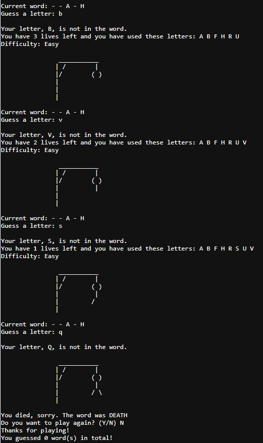

# **Hangman Game**
This repository contains a simple implementation of the classic Hangman game using C++. The game randomly selects a word from a predefined list, and the player's task is to guess the word letter by letter before running out of attempts. The game provides visual feedback through a hangman visualization to indicate the player's progress.

>  [!NOTE]
[Play Online Now!](https://tinyurl.com/bdzfr5x4) 

## **How to Play**
1. Clone or download the repository to your local machine.
2. Open a terminal window and navigate to the downloaded directory.
3. Compile the C++ code using a C++ compiler. For example: g++ hangman.cpp -o hangman
4. Run the compiled executable to start the game:./hangman
5. The game will display a set of dashes representing the letters of the chosen word and the hangman's visual representation.
6. Enter a single letter as your guess and press Enter.
7. If the guessed letter is part of the word, it will be revealed on the screen. Otherwise, the hangman's visual will be updated, and you will lose a life.
8. Continue guessing until you correctly identify the word or run out of lives.
### **Game Features**
- The game randomly selects words from a predefined list to keep the game challenging and engaging.
- The difficulty level is displayed based on the length of the word, categorized as "Easy," "Medium," or "Hard."
- The game provides a visual representation of the hangman to visualize the player's progress.
- The player can play multiple rounds of Hangman without restarting the program.
- The game checks for valid input and ensures the player enters a single letter as their guess.
- The terminal screen is cleared between rounds for a clean and seamless experience.
### **Improvements and Contributions**
This Hangman game implementation is intended as a simple showcase of C++ programming and can be expanded and enhanced in various ways. Contributors are welcome to suggest improvements, add new features, or refactor the code to improve its readability and maintainability.

### Special Thanks
Credits to [kying18](https://github.com/kying18) for the initial idea and the visual hangmans.

**License**

This Hangman game is open-source and available under the [MIT License](LICENSE). Feel free to use, modify, and distribute the code as per the license terms.

<!--- Eraser file: https://app.eraser.io/workspace/w5K1jrAOFNCPXOOCfOFl --->